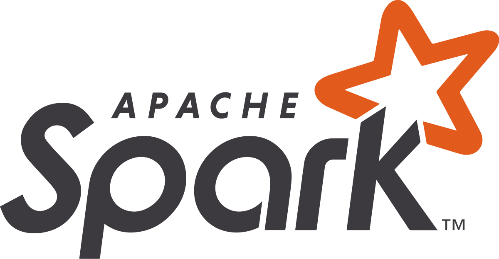

# Udacity Data Engineering Nanodegree projects
This repository contains the links to the projects I submitted for the [Udacity Data Engineering Nanodegree Program](https://www.udacity.com/course/data-engineer-nanodegree--nd027). 

Check the program's [syllabus](https://d20vrrgs8k4bvw.cloudfront.net/documents/en-US/Data+Engineering+Nanodegree+Program+Syllabus.pdf) for more details.

## Project 1a: [Data Modeling with Postgres](https://github.com/nasseredine/udacity-dend-p1a) (Relational Database)

 

Model user activity data to create a relational database and ETL pipeline in PostgreSQL for a music streaming app.
- Installed PostgreSQL and configured a new user and database.
- Designed an optimized **star schema** (i.e. with a **fact** and **dimensions** tables) with **normalized** tables (i.e. using constraints) for queries on song play analysis.
- Built an ETL pipeline to extract data from `.json` files, transform incorrect values and insert them into the tables with `psycopg2` Python package.
- Ran test to verify the database creation.
- Created examples queries and expected results.

## Project 1b: [Data Modeling with Apache Cassandra](https://github.com/nasseredine/udacity-dend-p1b) (NoSQL Database)

Model event data to create a non-relational database and ETL pipeline in Apache Cassandra for a music streaming app.
- Installed Apache Cassandra.
- Designed optimized queries using **denormalized** tables.
- Built an ETL pipeline to extract data from `.csv` files, transform incorrect values and insert them into the tables with `cassandra` Python package.

## Project 2: [Data Warehouse on AWS with Amazon Redshift](https://github.com/nasseredine/udacity-dend-p2)

Build a Data Warehouse and an ETL pipeline that extracts data from Amazon S3, stages them in Amazon Redshift, and transforms data into a set of dimensional tables for their analytics team.

## Project 3: [Data Lake on AWS S3 using Apache Spark](https://github.com/nasseredine/udacity-dend-p3)

 

Build a Data Lake and an ETL pipeline in Apache Spark that loads data from S3, processes the data into analytics tables, and loads them back into S3.

## Project 4: [Data Pipelines with Airflow](https://github.com/nasseredine/udacity-dend-p4)

 

Improve the company's data infrastructure by creating and automating a set of data pipelines with Airflow, monitoring and debugging production pipelines.

